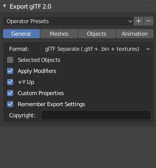
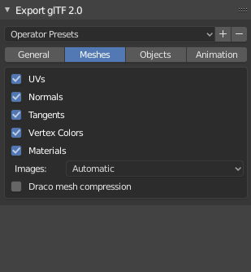
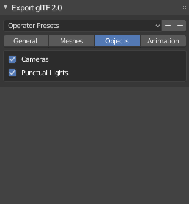
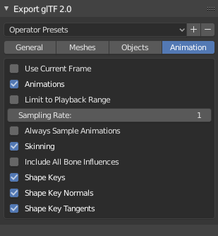

# LibGDX - GLTF Documentation

**Draft**

## Rendering options

### Rendering to frame buffer

Sometimes you want ot render scenes to a FBO (Frame buffer). You can do it but you have to take some cautions: SceneManager is using FBOs internally to render shadows. So, instead of calling sceneManager.render(), you have to do something like this:

```java
sceneManager.renderShadows();
		
fbo.begin();
...
sceneManager.renderColors();
...
fbo.end();
```

### Advanced Fog

Fog can be enabled like with libGDX default shader:

`sceneManager.environment.set(new ColorAttribute(ColorAttribute.Fog, Color.WHITE));`

Additional fog settings help to configure fog behavior : 

* near and far clipping fog planes, by default same has camera near and far.
* exponent (default 1.0) can be used to tweak fog : above 1 will push the fog to back, below 1 will pull fog to front.

Note that near and far can be inverted to produce a kind of unrealistic back light effect.

`sceneManager.environment.set(new FogAttribute(FogAttribute.FogEquation).set(near, far, exponent));`

### SkyBox

TODO

### use default libGDX shader instead of PBR Shader

PBR shader is used by default which enable all glTF features and gives relatively realistic results.

However, for performance reasons you may want a simpler shader. Obviously you can create your own shader but you can use default libGDX shader as well. In this case, only few features will be supported and rendering will be less rich.

You can use default shader provider to be used with scene manager.

`new SceneManager(new DefaultShaderProvider());`

### Shadows

TODO explain provided shadow light, only dirs, how to enable, etc...

### directional lights intensity

TODO explain DiLightEx with intensity parameter...

## Animations

Scene own a AnimationController to play animation on its modelInstance (regular libgdx animation player).

When your scene is an individual model (single skeleton) you typically use `scene.animationController` to play
single animation and actions.

Also, Scene own a more advanced animation player providing some features like playing multiple animations.

When your scene is made of several individual models with their own animation (cinematic scene), you want to play a bunch
of animation on the same modelInstance. In this case use `scene.animationsPlayer` instead of `scene.animationController`.


## Export from Blender (2.80+)

### A complete example

### GLTF exporter options

Based on glTF Exporter 0.9.36 addon.

Here is the recommended settings and some hint about some of them :



**General settings:**

* Format: glTF separate is recommended for best loading time performances and compatibility.

<br style="clear: both;">




**Mesh settings:**

* Normals: not mandatory but recomended, when not exported flat normals will be generated at loading time.
* Tangents: only important if your models use normal maps. Include them for better loading time.
* Vertex Colors: only one vertex color attribute is supported by gdx-gltf PBR shader but you can have multiple one to be used in your custom shader or any other advanced usage.
* Draco mesh compression: not supported by gdx-gltf for now.

<br style="clear: both;">




**Object settings:**

* Cameras: exports cameras.
* Punctual lights: export lights (all light types). Note: Area Lights are not supported by Blender exporter.


<br style="clear: both;">




**Animation settings:**

* Always Sample Animation: Required when using bone constraints (IK), set a proper Sampling Rate in this case to limit number of keyframes: too many keyframes may impact performances (loading, memory and playback).
* Include All Bone Influences: by default, exporter will limit to 4 influences (4 bones influences a vertex), you can disable this limit if you need more: gdx-gltf supports up to 8 influences, you then have to manually limit influences in your skinning (in Weight Paint mode, you can limit total weights).
* Shape Key Tangent: required if your model with shape keys uses normal maps.

<br style="clear: both;">


### Custom properties (DRAFT)

glTF Extras are user defined structured data (JSON) attached to any GLTFObject, typically a key value pair.

Blender allow user defined custom properties on several entities (objects, material, etc). These custom properties are exported in related GLTF entity extras.

GLTF data structure is not kept in memory beyond loading by default to save memory usage. If you need data structure,
you need to enable it either by direct loading :

`new GLTFLoader.load(myFile, true)`

or via AssetLoader parameters:

`assetManager.load("myFile.gltf", new GLTFLoaderParameter(true));`

For instance Blender GLTF exporter may save some of its own settings, you can retreive them like this:

`sceneAsset.data.extras.get("glTF2ExportSettings")`


```
glTF2ExportSettings: {
	export_apply: 1
	export_cameras: 1
	export_copyright: mgsx
	export_extras: 1
	export_format: GLTF_SEPARATE
	export_lights: 1
	export_morph_tangent: 1
	export_tangents: 1
}
```

here is the list of all supported custom properties (properties exported within your GLTF files)
and mapping from Blender entities to GLTF entities and LibGDX entities:

* Blender Object => GLTFNode => Node
* TODO more... and test


Another example of custom properties on a Blender Object:


Because GLTF data structure differs from libGDX structure, you have to browse loaded GLTF data structure yourself, e.g.:

```
Array<GLTFNode> nodes = sceneAsset.data.nodes;
for(GLTFNode node : nodes){
	if(node.name.equals("Cube"){
		float myValue = node.extras.getFloat("myProperty");
	}
}
```

Note that in Blender you can manually define key/value pairs (with float value) only. However you can define any JSON structure
via scripting. For instance, you can copy some Blender specific settings like Empty type and size this way :

```
import bpy;
for object in bpy.data.objects:
    if not object.data:
        object["Empty"] = {
            "size": object.empty_display_size,
            "type": object.empty_display_type
        }
```

You can the retreive this structured data structure from GLTF nodes in your game.


### Blending

Only Principled BSDF shader is supported

TODO : blending mode, where opacity is stored... 
