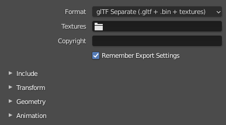
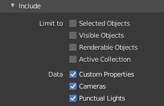
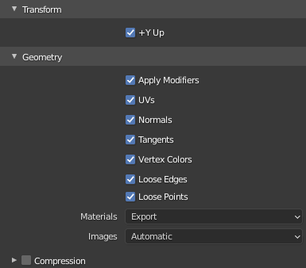
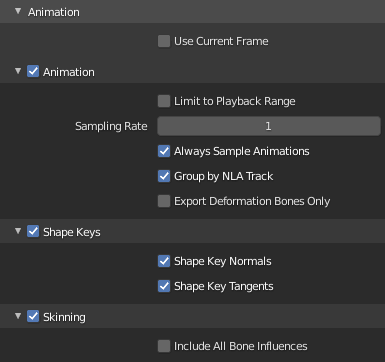
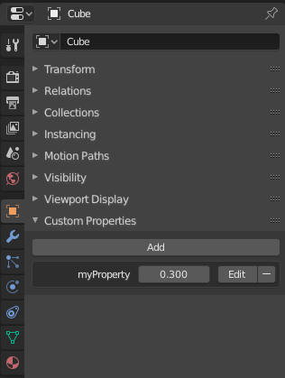

# LibGDX - GLTF Documentation

**Draft**

## Rendering options

### Rendering to frame buffer

Sometimes you want ot render scenes to a FBO (Frame buffer). You can do it but you have to take some cautions: SceneManager is using FBOs internally to render shadows. So, instead of calling sceneManager.render(), you have to do something like this:

```java
sceneManager.renderShadows();
		
fbo.begin();
...
sceneManager.renderColors();
...
fbo.end();
```

Also, sometimes you want to capture depth only. You can do it like this : 

```java		
fbo.begin();
sceneManager.renderDepth();
fbo.end();
```

### Advanced Fog

Fog can be enabled like with libGDX default shader:

`sceneManager.environment.set(new ColorAttribute(ColorAttribute.Fog, Color.WHITE));`

Additional fog settings help to configure fog behavior : 

* near and far clipping fog planes, by default same has camera near and far.
* exponent (default 1.0) can be used to tweak fog : above 1 will push the fog to back, below 1 will pull fog to front.

Note that near and far can be inverted to produce a kind of unrealistic back light effect.

`sceneManager.environment.set(new FogAttribute(FogAttribute.FogEquation).set(near, far, exponent));`

### SkyBox

TODO

### use default libGDX shader instead of PBR Shader

PBR shader is used by default which enable all glTF features and gives relatively realistic results.

However, for performance reasons you may want a simpler shader. Obviously you can create your own shader but you can use default libGDX shader as well. In this case, only few features will be supported and rendering will be less rich.

You can use default shader provider to be used with scene manager.

`new SceneManager(new DefaultShaderProvider(), new DepthShaderProvider());`

### Shadows

TODO explain provided shadow light, only one dir light, how to enable, etc...

### directional lights intensity

TODO explain DiLightEx with intensity parameter...

### Lights range

Point lights and Spot lights range can be exported from blender (using custom distance option).
This range can be used for light frustum culling
Default libgdx lights doesn't have this information, you can cast loaded lights from your GLTF files
by casting them to PointLightEx or SpotLightEx to retrieve the range field.

### Displacement maps

TODO implements Displacement map with/without tesslation shader..

## Animations

Scene own a AnimationController to play animation on its modelInstance (regular libgdx animation player).

When your scene is an individual model (single skeleton) you typically use `scene.animationController` to play
single animation and actions.

Also, Scene own a more advanced animation player providing some features like playing multiple animations.

When your scene is made of several individual models with their own animation (cinematic scene), you want to play a bunch
of animation on the same modelInstance. In this case use `scene.animationsPlayer` instead of `scene.animationController`.

## Customizations

### Extends PBR shader

There are several way to extends PBR shaders : 
* by providing custom vertex and fragment shader code.
* by subclassing PBRShaderProvider
* by subclassing both PBRShaderProvider and PBRShader

Note that PBRDepthShader can be customized as well in the same way.

### Vertex colors

As libgdx default shader, default PBR shader use supports 1 color attribute used to multiply base color.

If you want to implement a custom shader to support more vertex color layers, you have to enable by setting **PBRConfig#numVertexColors**.

You can then retrieve attributes in your custom vertex shader : **a_color1** for 2nd layer, **a_color2** for 3rd layer and so on. 
For compatibility reasons, 1st layer is **a_color**


## Export from Blender (2.93 LTS or newer)

First you have to read the [Blender GLTF exporter documentation](https://docs.blender.org/manual/en/2.93/addons/import_export/scene_gltf2.html) to know how to setup your materials and what kind of objects can be exported.

### GLTF exporter options

Based on glTF Exporter 1.6.16 addon (Blender 2.93.1 LTS).

Here is the recommended settings and some hint about some of them :

**General settings:**



* Format: glTF separate is recommended for best loading time performances and compatibility.

**What to include:**



* Limit to: By default Blender export only enabled collections. It's helpful to exclude some objects (guides) or split into several files. You can check some boxes here to fine tune your selection.
* Cameras and Punctual lights: Check these if your want to export cameras and lights (point, sun and spot lights are supported)
* Custom properties: should be checked if you want to export shape keys names or any user defined properties, see [Custom Properties section](#custom-properties)

**Geometry settings:**



* Normals: not mandatory but recomended, when not exported flat normals will be generated at loading time.
* Tangents: not mandatory but recomended, when not exported they are generated at loading time.
* Vertex Colors: only one vertex color attribute is supported by gdx-gltf PBR shader but you can have multiple one to be used in your custom shader or any other advanced usage.
* Looses Edges and Points: Export edges only models or vertex only models. They will be rendered as `GL_LINES` or `GL_POINTS`.

Note that these attributes will only be exported when geometry have them. For example, if an object doesn't have UVs, the exported mesh won't have UVs even if the box is checked, so it doesn't hurt to have them checked.

* Compression: not supported by gdx-gltf for now.

**Animation settings:**



* Use current frame: You rarely want that, when unchecked it will export models in base pose regardless of current playback frame.
* Limit to playback range: You rarely want that, when unchecked it will export animations as is regardless of current playback range.
* Always Sample Animation: Required when using bone constraints (IK), set a proper Sampling Rate in this case to limit number of keyframes: too many keyframes may impact performances (loading, memory and playback).
* Group by NLA track: You need to have this checked in order to export all animations including not active ones (stashed or pushed).
* Export deformation bones only: Uncheck that if you want to export some bones used as placeholder (eg. weapon attachement).
* Include All Bone Influences: by default, exporter will limit to 4 influences (4 bones influences a vertex), you can disable this limit if you need more: gdx-gltf supports up to 8 influences, you then have to manually limit influences in your skinning (in Weight Paint mode, you can limit total weights).
* Shape Key Tangent: required if your model with shape keys uses normal maps.


### Custom properties

glTF Extras are user defined structured data (JSON) attached to any GLTFObject, typically a key value pair.

Blender allow user defined custom properties on several entities (objects, material, etc). These custom properties are exported in related GLTF entity extras.

GLTF data structure is not kept in memory beyond loading by default to save memory usage. If you need data structure,
you need to enable it either by direct loading :

`new GLTFLoader.load(myFile, true)`

or via AssetLoader parameters:

`assetManager.load("myFile.gltf", new GLTFLoaderParameter(true));`

For instance Blender GLTF exporter may save some of its own settings, you can retreive them like this:

`sceneAsset.data.extras.get("glTF2ExportSettings")`


```
glTF2ExportSettings: {
	export_apply: 1
	export_cameras: 1
	export_copyright: mgsx
	export_extras: 1
	export_format: GLTF_SEPARATE
	export_lights: 1
	export_morph_tangent: 1
	export_tangents: 1
}
```

here is the list of all supported custom properties (properties exported within your GLTF files)
and mapping from Blender entities to GLTF entities and LibGDX entities:

* Blender Object => GLTFNode => Node
* TODO more... and test


Another example of custom properties on a Blender Object:



Because GLTF data structure differs from libGDX structure, you have to browse loaded GLTF data structure yourself, e.g.:

```
Array<GLTFNode> nodes = sceneAsset.data.nodes;
for(GLTFNode node : nodes){
	if(node.name.equals("Cube"){
		float myValue = node.extras.getFloat("myProperty");
	}
}
```

Note that in Blender you can manually define key/value pairs (with float value) only. However you can define any JSON structure
via scripting. For instance, you can copy some Blender specific settings like Empty type and size this way :

```
import bpy;
for object in bpy.data.objects:
    if not object.data:
        object["Empty"] = {
            "size": object.empty_display_size,
            "type": object.empty_display_type
        }
```

You can the retreive this structured data structure from GLTF nodes in your game.


### Blending

Only Principled BSDF shader is supported

TODO : blending mode, where opacity is stored... 

### Shape Keys

Shape keys are converted to Morph targets in GLTF structure. It's limited to 8 morph targets, so up to 8 shape keys in addition to "Basis" shape keys.

Note that [most GPU support up to 16 vertex attributes](https://opengl.gpuinfo.org/displaycapability.php?name=GL_MAX_VERTEX_ATTRIBS)
so a lot of shape keys might be a problem, especially if you have both position, normals and tangents. See [Limitation section](../README.md#troubleshooting) for more information.

Blender GLTF exporter export shape keys names via Custom properties. So you need to enable custom properties export in order to retrieve them.

Shape keys names are stored in Node object and can be used like this : 

```java
NodePlus nodePlus = (NodePlus)node;
int shapeKeyIndex = nodePlus.morphTargetNames.indexOf("HappyFace");
nodePlus.weights.values[index] = 0.7f;
```

If you didn't have shape keys names, you still can set weights but you have to know shape key index.

### Vertex color

Current Blender exporter [only export 2 vertex color layers](https://github.com/KhronosGroup/glTF-Blender-IO/blob/master/addons/io_scene_gltf2/blender/exp/gltf2_blender_extract.py#L49)

if you need more, you can always modify your local file in *BlenderInstallDirectory/scripts/addons/io_scene_gltf2/blender/exp/gltf2_blender_extract.py* and restart Blender.

### Troubleshottings

#### Morph targets

Morph targets are not exported when modifiers have to be applied.

There is no workaround since modifiers can't be applied when a mesh has shape keys defined.

You should then apply modifiers (eg. subsurface) before defining your shapekeys. 

## Other topics to explain (TODO)

* how to customize PBR shader
* how advanced fog works
* programatically create models (with all GLTF features... shape keys and such)
* all PBR shader options and static options
